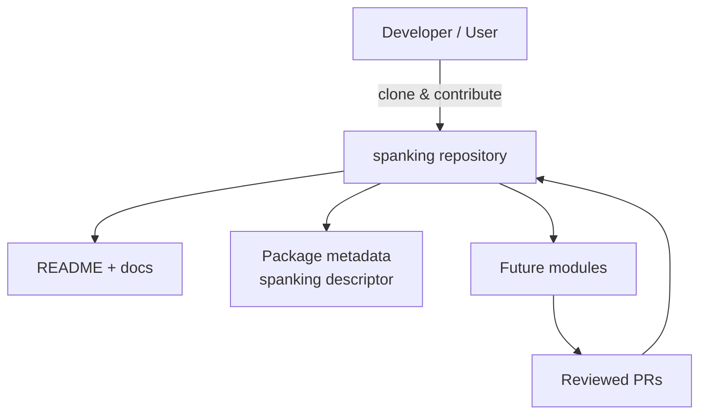

<p align="center">
  
</p>

> **Developed by [Arslan Malik](https://github.com/arsalanmaalik461)**
> 📱 WhatsApp: [+92 300 8987448](https://wa.me/923008987448) · 🌐 Website: [arslanmalik.tech](https://arslanmalik.tech)

---

## 🌟 Executive Overview

**Spanking** is a new, experimental project repository — currently a starter with only a stub README and package metadata (`spanking`, a tea.xyz package descriptor). No application code is committed yet, so this README deliberately avoids inventing features, users, or statistics. It describes the project's current state honestly and will grow alongside the code.

The repository is bootstrapped and ready: branded documentation, a clean tree, and a contribution path from day one. As the first real module lands, the overview, feature table, architecture diagram, and setup guide will be rewritten from the actual sources — not the other way around.

---

## 📑 Table of Contents

- [✨ Key Features & Highlights](#-key-features--highlights)
- [🖥️ Feature Showcase](#️-feature-showcase)
- [🏗️ System Architecture](#️-system-architecture)
- [🚀 Quickstart & Installation Guide](#-quickstart--installation-guide)
- [📂 Project Structure](#-project-structure)
- [🛡️ Security & Notes](#️-security--notes)

---

## ✨ Key Features & Highlights

| Feature | Description |
| :--- | :--- |
| 🧪 Starter repository | Clean slate with package metadata in place, ready for the first module |
| 📦 Package descriptor | `spanking` file with tea.xyz metadata (`version: 1.0.0`) already committed |
| 📖 Living documentation | This README is updated to match the code as it is committed |
| 🤝 Contribution-friendly | Issues and pull requests welcome from day one |

---

## 🖥️ Feature Showcase

### 1. Project Bootstrapping

> *"Document the intent first, then let the code earn its features."*

- Branded README and banner so the repo looks professional from commit zero
- Standard Git workflow: feature branches, reviewed pull requests, tagged releases
- Clear ownership: maintained by Arslan Malik

### 2. Clean-Foundation Discipline

> *"Every claim in this README must point at code in the tree."*

- No invented users, downloads, or benchmarks — only what is committed
- Package metadata (`spanking`) tracks versioning from the start
- Security baseline: no secrets committed, ever

---

## 🏗️ System Architecture



---

## 🚀 Quickstart & Installation Guide

The first application code has not landed yet. When it does, installation steps will be written here from the real manifest files.

```bash
# Clone the repository
git clone https://github.com/arsalanmaalik461/spanking.git
cd spanking

# Watch for the first real module — setup instructions will appear here
```

**Planned:** stack-specific install steps (language runtime, dependency manager, environment variables) derived from the actual manifests once committed.

---

## 📂 Project Structure

```text
spanking/
├── README.md               # This file
├── spanking                # tea.xyz package metadata (version 1.0.0)
└── docs/
    └── assets/
        └── banner.svg      # Project banner
```

> The tree will be regenerated from the actual repository as modules are added.

---

## 🛡️ Security & Notes

- **No secrets in the repo.** Tokens, API keys, and credentials stay in environment variables or a local `.env` file (gitignored), never committed.
- **Report issues** via the GitHub issue tracker — include steps to reproduce and expected behavior.
- Package metadata (`spanking`) is managed via [tea.xyz](https://tea.xyz); keep the descriptor in sync with releases.

---

<p align="center">
  Developed with ❤️ by <a href="https://github.com/arsalanmaalik461">Arslan Malik</a><br>
  📱 WhatsApp: <a href="https://wa.me/923008987448">+92 300 8987448</a> · 🌐 Website: <a href="https://arslanmalik.tech">arslanmalik.tech</a>
</p>
